# Mi primera practica integradora

Aplicar todo lo visto en clase hasta el momento. 

Desarrollo de mi aplicacion: 

* 1_ Get products : http://localhost:8080/api/products 

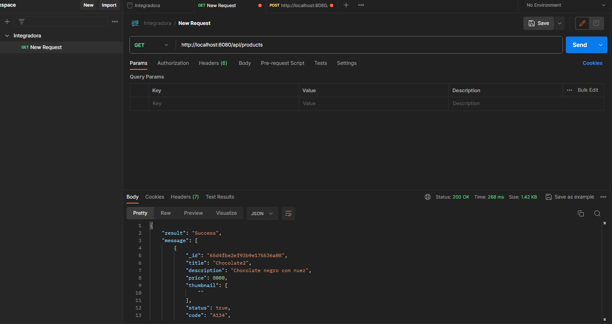

* 2_ Get with limit: http://localhost:8080/api/products?limit=2

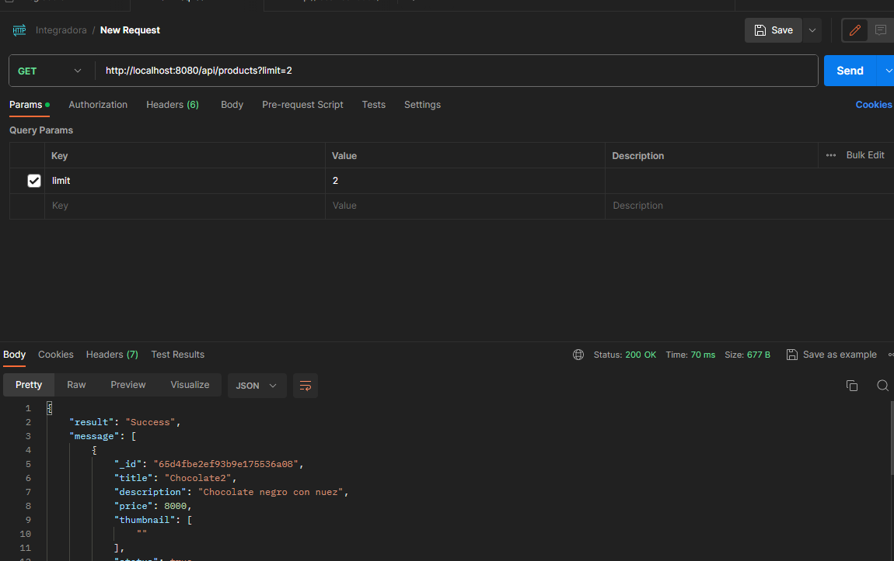

* 3_ Get with only one ID: http://localhost:8080/api/products/65d4fbe2ef93b9e175536a08

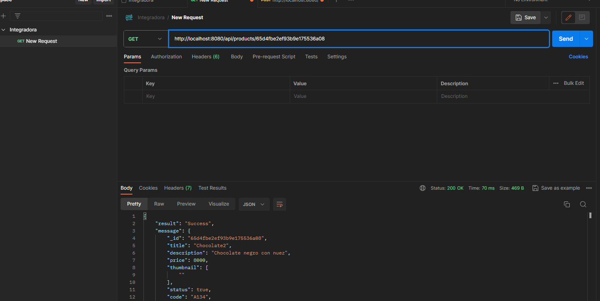

* 4_ Post adding products: http://localhost:8080/api/products/

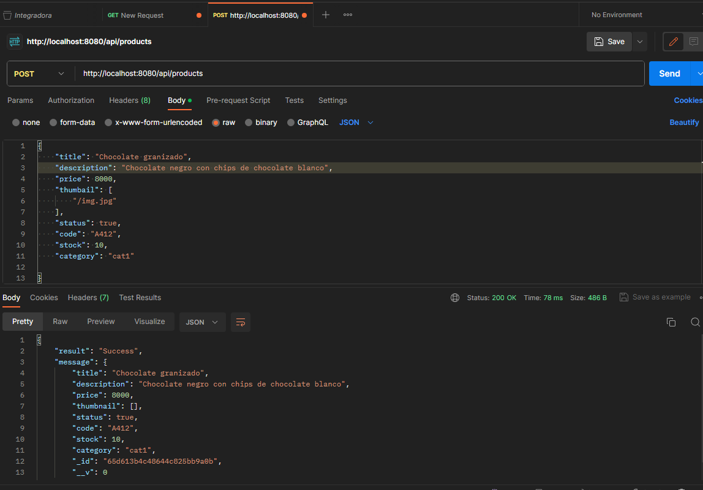

* 5_ Put (modified product)

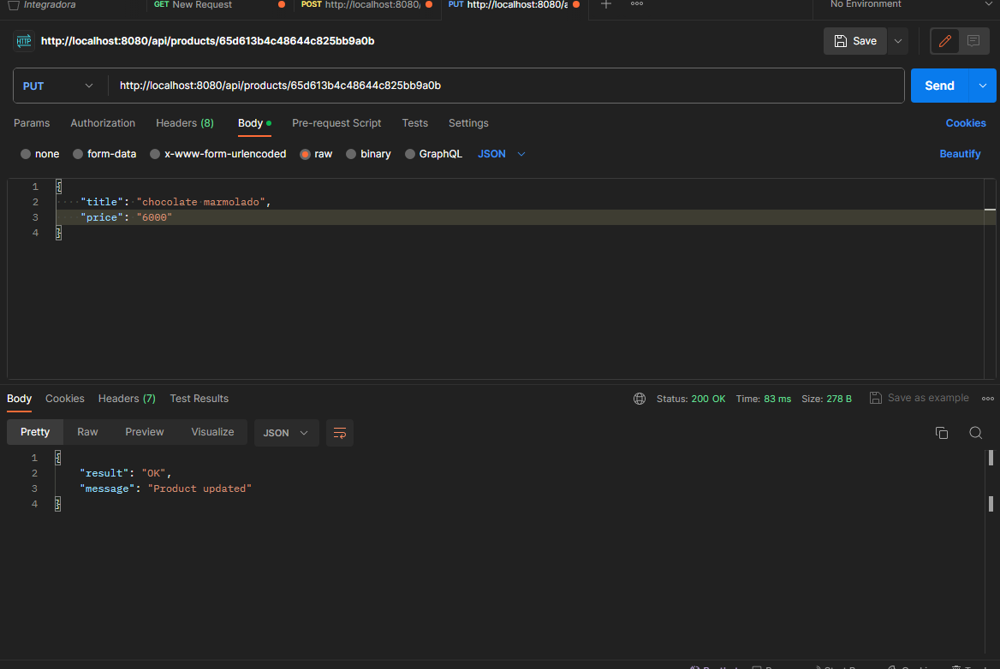

* 6_ Interface products only

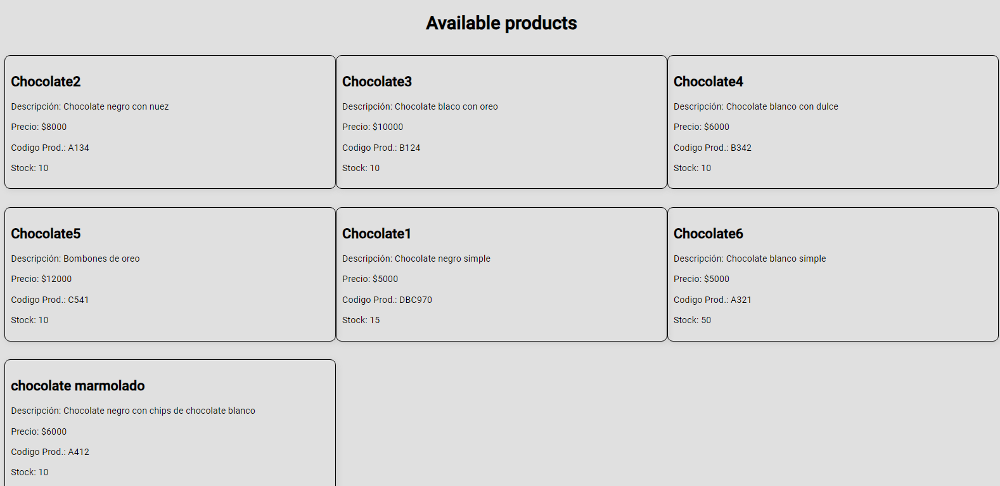

* 7_ Real time products (mannager products)

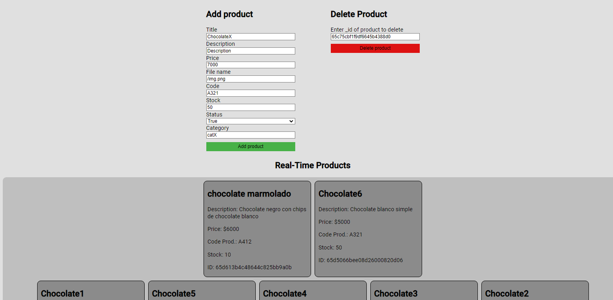

* 8_ Chat online

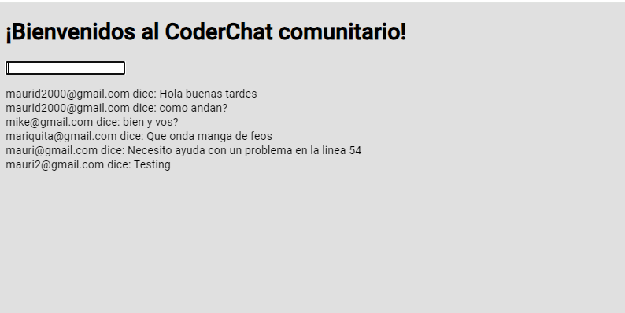

SAVED IN ATLAS DB. 
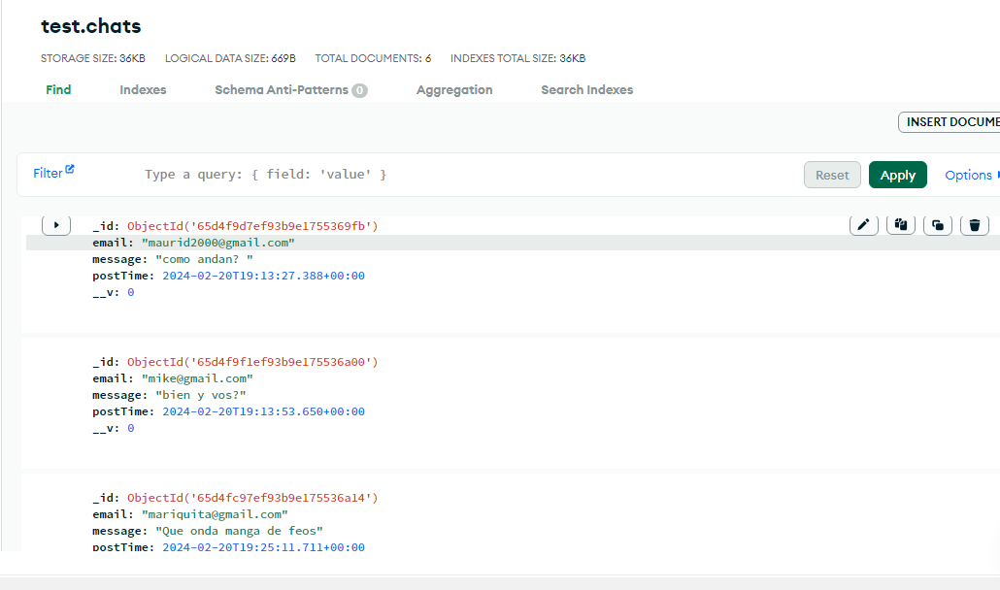

USER ONLINE 
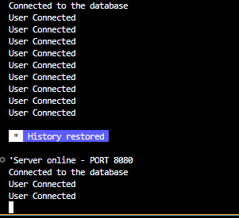

* 9_ Products in carts with ID. (via postman)
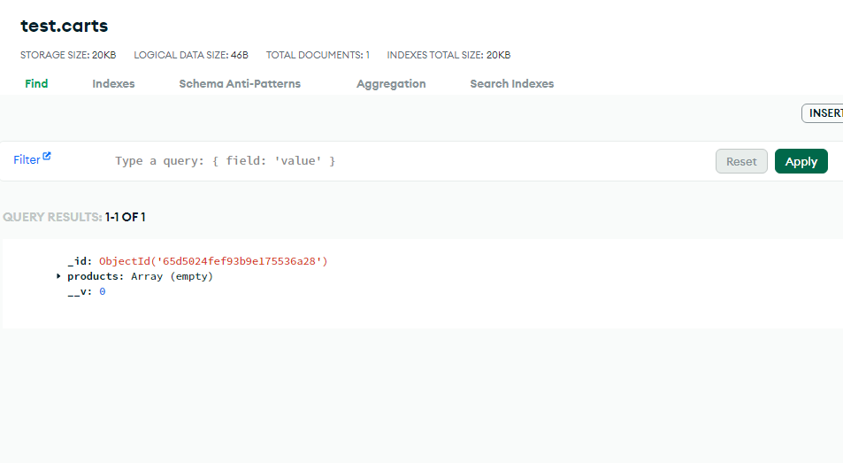

Faltaria mejorar la interfaz como tambien agregar imagenes a los productos. Creo que cumple con los objetivos de la entrega. 

